# Neural Network Comparison: From Scratch on CelebA Smiling Classification

> Building a **Perceptron, MLP, and CNN entirely from scratch in NumPy** — no ML frameworks — to classify facial expressions on the CelebA dataset.

---

## Overview

Most ML projects rely on PyTorch or TensorFlow to handle the heavy lifting. This project goes **one level deeper**: every forward pass, every backpropagation step, every gradient update is hand-coded in **pure NumPy**.

Four models are implemented and rigorously compared on a binary classification task: detecting whether a celebrity is smiling in the CelebA dataset.

---

## Results

| Model | Accuracy | Precision | Recall | F1-Score |
|---|---|---|---|---|
| Perceptron | 83.1% | 87.2% | 77.5% | 82.1% |
| MLP | 70.3% | 68.9% | 73.9% | 71.3% |
| Improved MLP | 66.4% | 65.7% | 68.6% | 67.1% |
| **CNN** | **85.2%** | **85.8%** | **84.4%** | **85.1%** |

> 💡 **Key finding: complexity doesn't always mean better results.** The simple Perceptron (83.1%) outperformed both the MLP (70.3%) and the Improved MLP (66.4%) — adding more layers and dropout actually hurt performance on this task. The CNN won not because it was the most complex, but because its architecture matched the problem: spatial convolutions are the right tool for image data.

---

## Training curves

### CNN
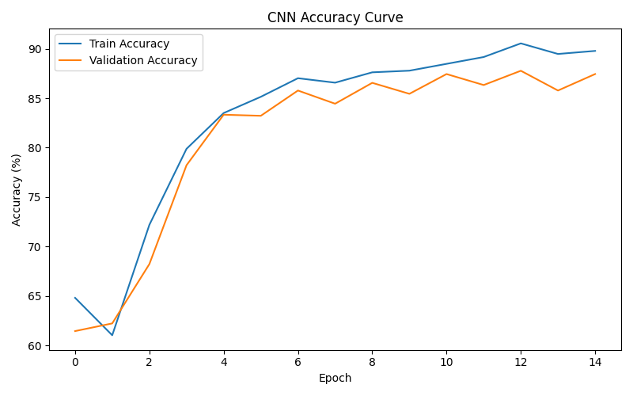
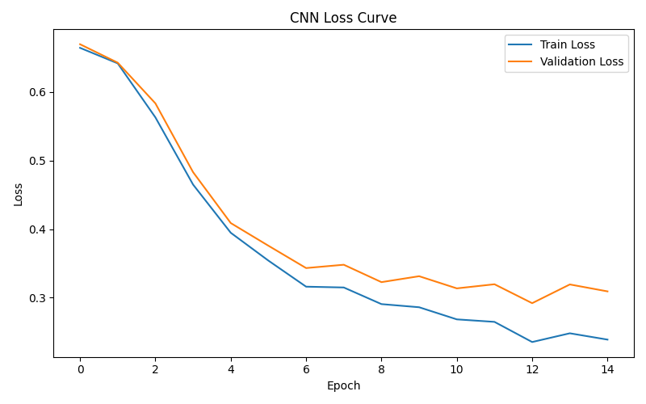

### Perceptron
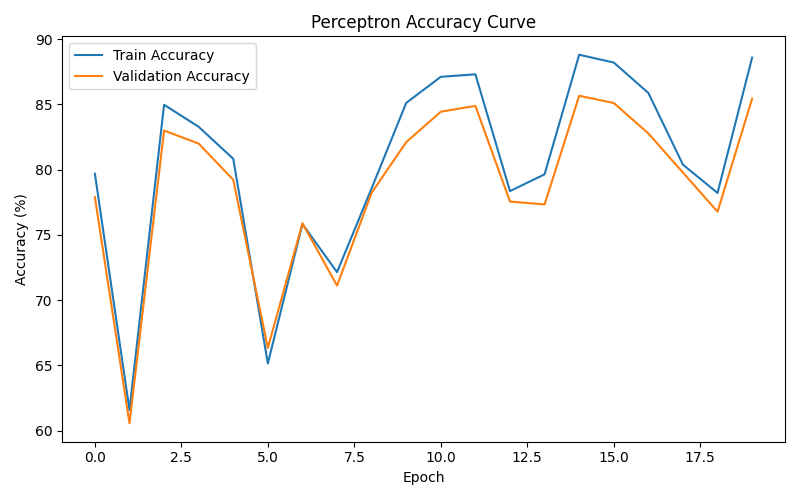

### MLP
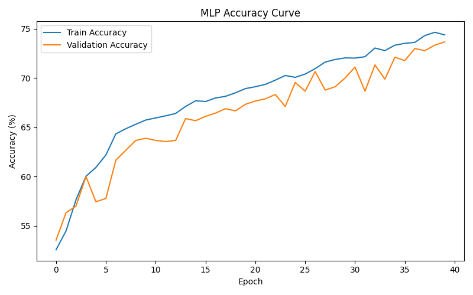
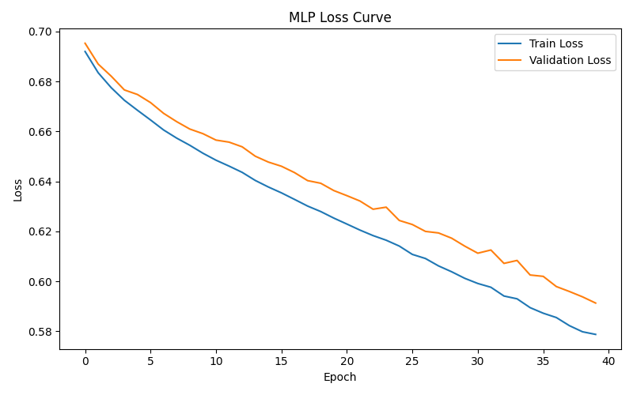

### Improved MLP
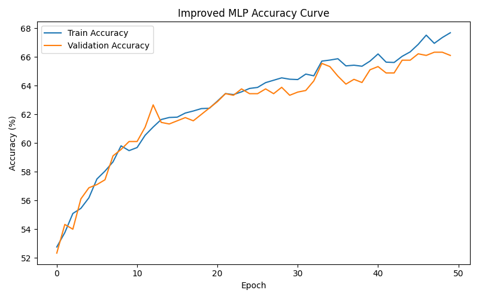
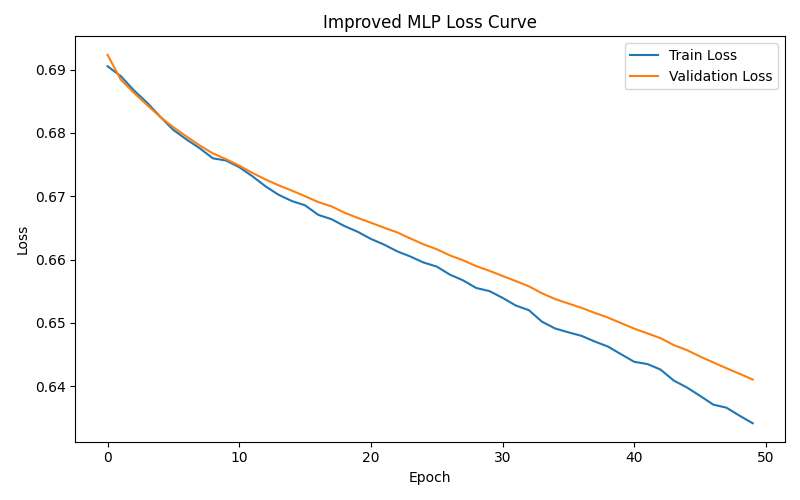

---

## Confusion matrices

### CNN
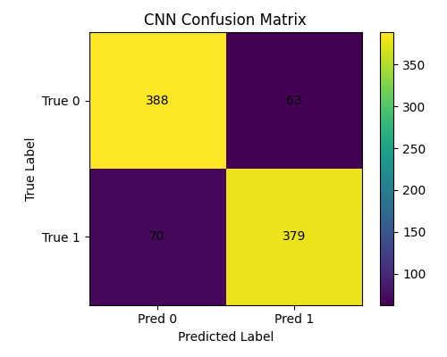

### Perceptron
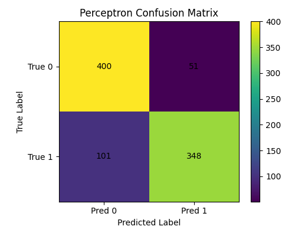

### MLP
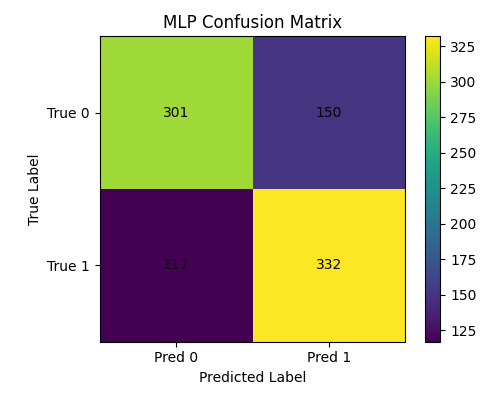

### Improved MLP
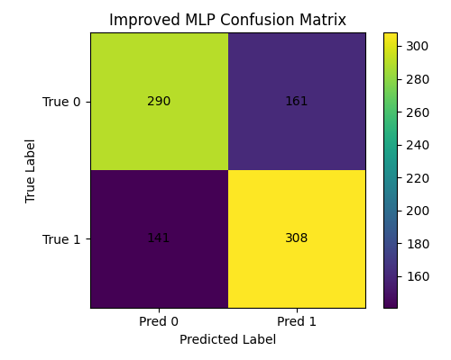

---

## Models Implemented (All from Scratch in NumPy)

### 1. Perceptron
- Linear decision boundary: `z = XW + b`
- Step activation function
- Binary classification with perceptron learning rule
- **Test Accuracy: 83.1%**

### 2. MLP (Multi-Layer Perceptron)
- Architecture: Input → Hidden(256) → Output
- ReLU activation, Adam-like updates
- **Test Accuracy: 70.3%**

### 3. Improved MLP
- Architecture: Input → Hidden(256) → Hidden(128) → Output
- Dropout regularization (rate: 0.2)
- Reduced learning rate (0.0005)
- **Test Accuracy: 66.4%**

### 4. CNN (Convolutional Neural Network)
- Architecture: Conv → ReLU → MaxPool → Flatten → FC → ReLU → Output → Sigmoid
- 8 filters of size 3×3
- Forward and backward pass implemented manually
- **Test Accuracy: 85.2%**  Best model

---

## Architecture Deep Dive (CNN)

```
Input (32×32×3 RGB image)
    │
    ▼
Convolution (8 filters, 3×3)
    │
    ▼
ReLU Activation
    │
    ▼
Max Pooling
    │
    ▼
Flatten
    │
    ▼
Fully Connected (hidden_dim=64) + ReLU
    │
    ▼
Output Layer + Sigmoid
    │
    ▼
Binary Prediction (Smiling / Not Smiling)
```

All layers — including the **conv layer's backward pass** — are implemented manually using NumPy array operations.

---

## Key Features

- **Zero framework dependency** for model code — pure NumPy throughout
- **Custom backpropagation** for all layers including convolution
- **Full comparison pipeline** — all 4 models evaluated on identical train/val/test splits
- **Rich visualizations** — confusion matrices, loss curves, accuracy curves, and metric bar charts for every model

---

## Project Structure

```
COSC3P96_Project/
├── perceptron.py              # Perceptron from scratch
├── mlp.py                     # MLP from scratch
├── mlp_improved.py            # MLP with dropout & tuning
├── cnn.py                     # CNN from scratch (NumPy only)
├── data_pipeline.py           # CelebA data loading & preprocessing
├── compare_results.py         # Side-by-side model comparison & plots
├── comparison_outputs/
│   ├── summary_metrics.csv    # All model results
│   ├── model_accuracy_comparison.png
│   ├── model_f1_comparison.png
│   ├── *_confusion_matrix.png
│   └── *_loss_curve.png
└── results/                   # Per-model detailed results
```

---

## Getting Started

### Prerequisites
```bash
pip install numpy matplotlib scikit-learn pillow
```

> **Dataset**: [CelebA](http://mmlab.ie.cuhk.edu.hk/projects/CelebA.html) — place images in `data/` and ensure attribute labels include the `Smiling` column.

### Run Data Pipeline
```bash
python data_pipeline.py
```
Preprocesses CelebA images to 32×32 RGB, extracts smiling labels, saves train/val/test splits.

### Train Individual Models
```bash
python perceptron.py       # Train perceptron
python mlp.py              # Train MLP
python mlp_improved.py     # Train improved MLP
python cnn.py              # Train CNN
```

### Compare All Models
```bash
python compare_results.py
```
Generates side-by-side accuracy, F1, precision, recall charts and confusion matrices for all models.

---

## Training Configuration

| Model | Hidden Dim | LR | Epochs | Batch Size |
|---|---|---|---|---|
| Perceptron | — | 0.0005 | — | — |
| MLP | 256 | 0.001 | 40 | 64 |
| Improved MLP | 256, 128 | 0.0005 | 50 | 64 |
| CNN | 64 | 0.001 | — | — |

---

## Tech Stack


>  **No PyTorch. No TensorFlow. No Keras.** Every gradient computed by hand.

---
